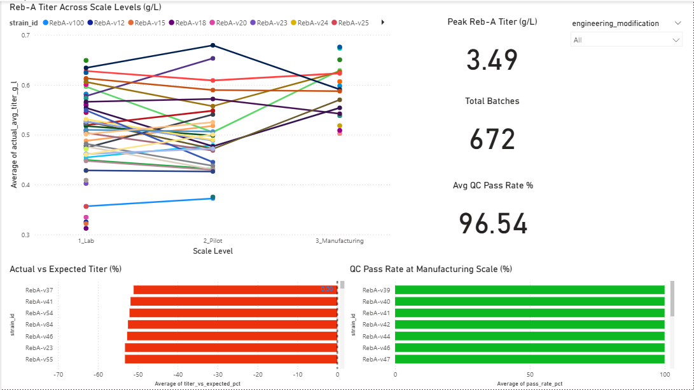
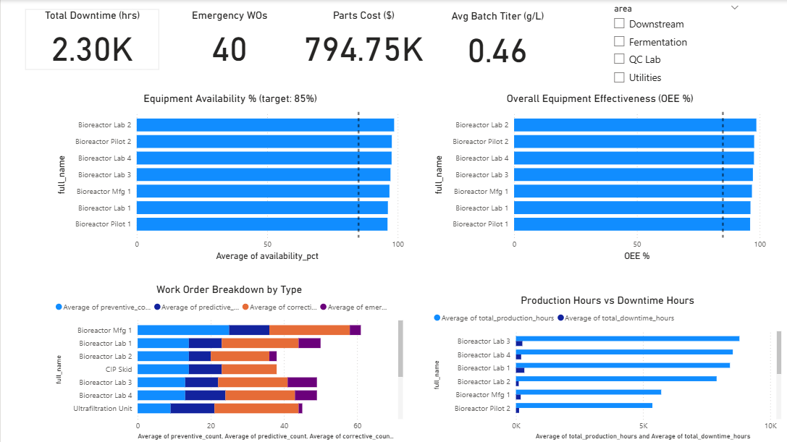
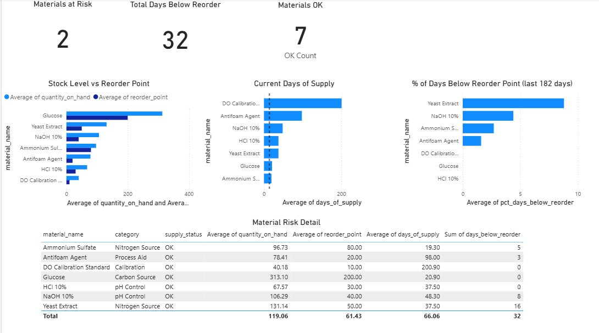

# Manus BioManufacturing Data Pipeline

Portfolio data engineering project — end-to-end pipeline for a synthetic biology manufacturing operation producing Rebaudioside-A (Reb-A) via precision fermentation.

## Architecture

```
5 Source Systems  →  Bronze (raw Delta)  →  Silver (Data Vault 2.0)  →  Gold (Star Schema)  →  Power BI
```

**Stack**: PySpark · Databricks · Delta Lake · Apache Kafka · FastAPI · Great Expectations · Power BI

## Quick start

```bash
pip install -r requirements.txt
cp .env.example .env   # fill in your values

# 1. Generate synthetic data
cd datagen_scripts/datagen_final
python run_all.py

# 2. Start local sources
python sources/lims/api.py            # FastAPI LIMS on :8000
python sources/bioreactor/producer.py # Kafka producer

# 3. Run ingestion (on Databricks or locally with PySpark)
python ingestion/kafka_consumer.py
python ingestion/lims_poller.py
python ingestion/csv_ingester.py
python ingestion/maintenance_ingester.py
python ingestion/strain_ingester.py

# 4. Run pipeline
python pipeline/bronze/standardize.py
python pipeline/silver/hubs.py && python pipeline/silver/links.py && python pipeline/silver/satellites.py
python pipeline/gold/facts.py && python pipeline/gold/dimensions.py && python pipeline/gold/kpi_views.py

# 5. Run quality checks
python quality/bronze_suite.py
python quality/silver_suite.py

# 6. Run tests
pytest tests/
```

## Data sources

| Source | Format | Rows | Ingestion pattern |
|---|---|---|---|
| Bioreactor sensors | Kafka stream | ~15M | Structured streaming |
| LIMS quality results | REST API | ~3,600 | Watermark poll |
| Supply chain inventory | CSV | ~1,260 | Daily file pickup |
| CMMS maintenance | SQLite | ~5,000 | Incremental SQL |
| Strain registry | SQLite | 100 | Full load on change |

## Dashboard

Power BI Desktop connects to Databricks SQL warehouse (`workspace.gold.*`).

### BioOptimization Cycle


### Equipment OEE


### Supply Chain Risk

